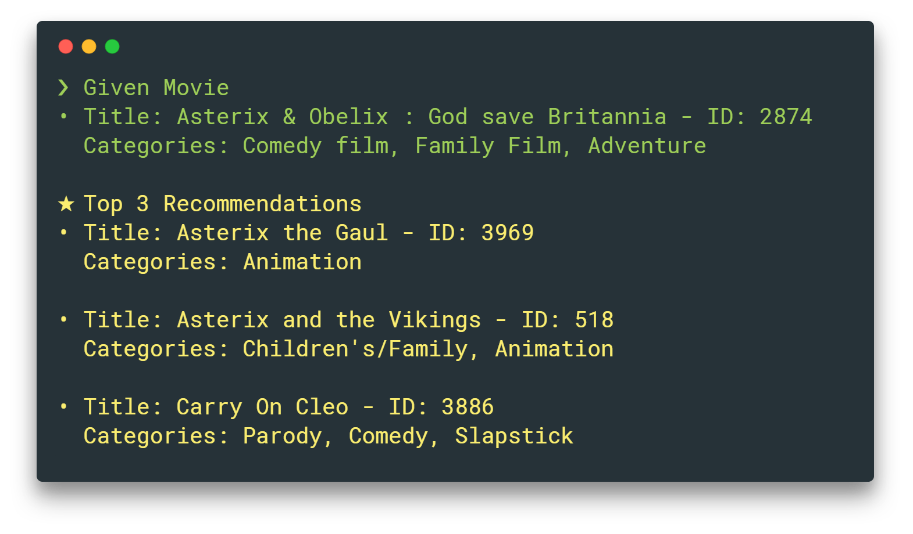

<h1 align="center">
  <br/>Moviebox
</h1>

<h4 align="center">
  🎥 Machine learning movie recommender
</h4>

<div align="center">
  <a href="https://github.com/klauscfhq/moviebox">
    
  </a>
</div>

[](https://travis-ci.org/klauscfhq/moviebox) [](https://pypi.org/project/moviebox/) [](https://pypi.org/project/moviebox/)

## Contents

- [Description](#description)
- [CLI](#cli)
- [Usage](#usage)
- [API](#api)
- [Development](#development)
- [Team](#team)
- [License](#license)

## Description

Moviebox is a content based machine learning recommending system build with the powers of [`tf-idf`](https://en.wikipedia.org/wiki/Tf%E2%80%93idf) and [`cosine similarities`](https://en.wikipedia.org/wiki/Cosine_similarity).

Initially, a natural number, that corresponds to the ID of a unique movie title, is accepted as input from the user. Through `tf-idf` the plot summaries of 5000 different movies that reside in the dataset, are analyzed and vectorized. Next, a number of movies is chosen as recommendations based on their `cosine similarity` with the vectorized input movie. Specifically, the cosine value of the angle between any two non-zero vectors, resulting from their inner product, is used as the primary measure of similarity. Thus, only movies whose story and meaning are as close as possible to the initial one, are displayed to the user as recommendations.

The [dataset](moviebox/dataset/movies.csv) in use is a random subset of the [Carnegie Mellon Movie Summary Corpus](http://www.cs.cmu.edu/~ark/movie$-data/), and it consists of `5000` movie titles along with their respective categories and plots.

The nature of the project is heavily educational.

## Install

**`Python 3+`** is required to install or build the code. Support for **`Python 2+`** will be added soon.

```
pip3 install moviebox
```

## CLI

```
$ moviebox --help

  🎥 Machine learning movie recommender

  Usage
    $ moviebox [<options> ...]

  Options
    --help, -h              Display help message
    --search, -s            Search movie by ID
    --movie, -m <int>       Input movie ID [Can be any integer 0-4999]
    --plot, -p              Display movie plot
    --interactive, -i       Display process info
    --list, -l              List available movie titles
    --recommend, -r <int>   Number of recommendations [Can be any integer 1-30]
    --version, -v           Display installed version

  Examples
    $ moviebox --help
    $ moviebox --search
    $ moviebox --movie 2874
    $ moviebox -m 2874 --recommend 3
    $ moviebox -m 2874 -r 3 --plot
    $ moviebox -m 2874 -r 3 -p --interactive
```

## Usage

```python
from moviebox.recommender import recommender

movieID = 2874  # Movie ID of `Asterix & Obelix: God save Britannia`
recommendationsNumber = 3  # Get 3 movie recommendations
showPlots = True  # Display the plot of each recommended movie
interactive = True  # Display process info while running

# Generate the recommendations
recommender(
    movieID=movieID,
    recommendationsNumber=recommendationsNumber,
    showPlots=showPlots,
    interactive=interactive)
```

## API

### recommender`(movieID, recommendationsNumber, showPlots, interactive)`

**E.g.** `recommender(movieID=2874, recommendationsNumber=3, showPlots=True, interactive=True)`

#### `movieID`

- Type: `Integer`

- Default Value: `2874`

- Optional: `True`

Input movie ID. Any integer between `[0, 4999]` can be selected.

#### `recommendationsNumber`

- Type: `Integer`

- Default Value: `3`

- Optional: `True`

Number of movie recommendations to be generated. Any integer between `[1, 30]` can be selected.

#### `showPlots`

- Type: `Boolean`

- Default Value: `False`

- Optional: `True`

Display the plot summary of each recommended movie.

#### `interactive`

- Type: `Boolean`

- Default Value: `False`

- Optional: `True`

Display process-related information while running.

## Development

- [Clone](https://help.github.com/articles/cloning-a-repository/) this repository to your local machine
- Navigate to your clone `cd moviebox`
- Install the dependencies `fab i`/`pip3 install -r requirements.txt`
- Check for errors `fab test`
- Run the API `fab start`
- Build the package `fab dist`
- Cleanup compiled files `fab clean`

## Team

- Mario Sinani ([@mariocfhq](https://github.com/mariocfhq))
- Klaus Sinani ([@klauscfhq](https://github.com/klauscfhq))

## License

[MIT](https://github.com/klauscfhq/moviebox/blob/master/license.md)
